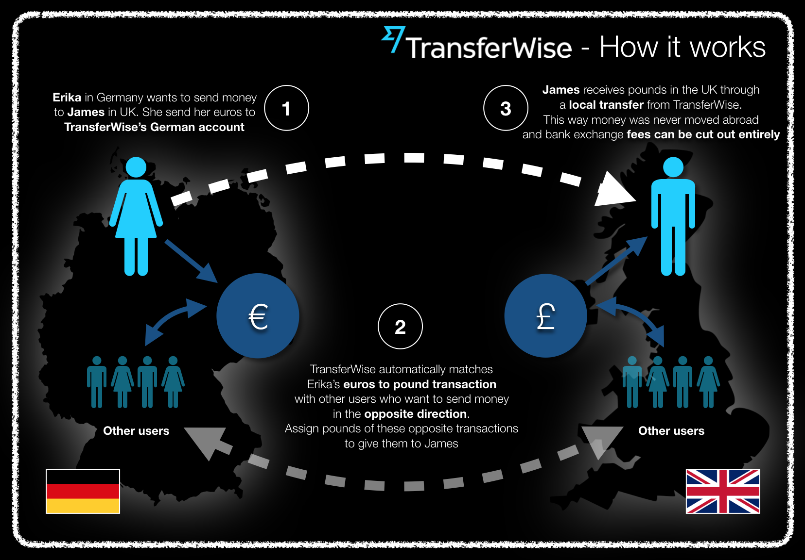

# Hawkore's TransferWise connector for Mule 4

This connector allows you integrate your Mule applications with **TransferWise** services. 

_TransferWise is authorized by the Financial Conduct Authority under the Electronic Money Regulations 2011, Firm Reference 900507, for the issuing of electronic money._

*All company names, logos, brand names and trademarks are property of their respective owners. All company, product and service names used in this product are for identification purposes only. Use of these names, logos, and brands does not imply endorsement.*

## Requirements

	-  Java >= 1.8.0_65 (OpenJDK and Sun have been tested)
	-  Maven >= 3.3.0
	-  Mule 4.2.1 (EE or community)k
	-  Anypoint Studio 7+ (Recomended version 7.3.4)

## Clone

	-  Clone this project: `git clone http://github.com/hawkore/examples-transferwise-connector-mule4.git`

## Content

1. `sample-transferwise-connector-mule4-appp`: Mule 4 application to test [Hawkore's TransferWise connector for Mule 4
](https://docs.hawkore.com/private/transferwise-connector-mule4/). See [README.md](sample-transferwise-connector-mule4-app/README.md) for more info.

# More resources

Sign up at [www.hawkore.com](https://www.hawkore.com) to access full documentation.
